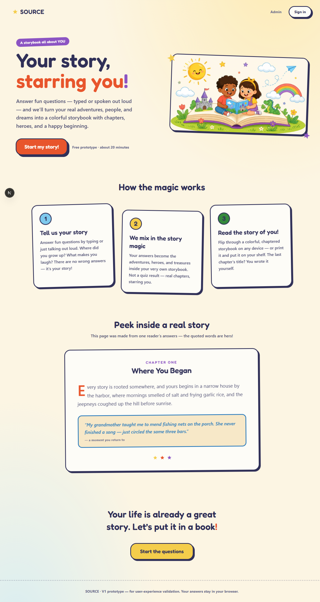
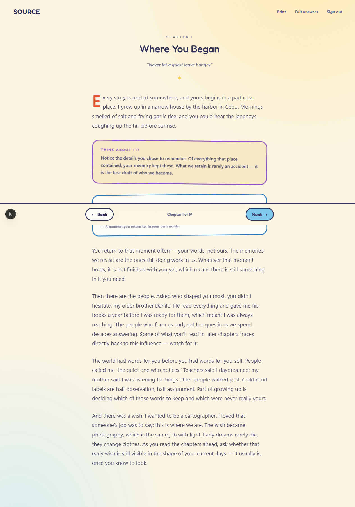
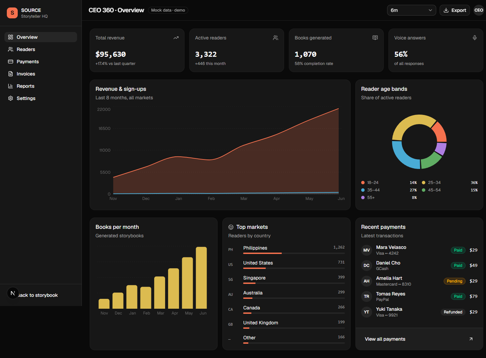

# SOURCE — Interactive Personalized Book Prototype

A V1 proof of concept for **SOURCE**, a personalized storytelling book.
Readers answer a guided questionnaire (typed or spoken) and receive a
chaptered storybook in which every example, reflection, and case study is
drawn from their own answers.

**Design**: "Crayon Storybook" — a cartoonized, kid-friendly system with
Fredoka + Nunito rounded type, a crayon palette (coral, sunshine, sky, grass,
grape on cream), thick-outline "sticker" components, and an AI-generated hero
illustration (Higgsfield GPT Image 2, low-res 68 KB WebP for fast web loads).




**Admin**: a separate "CEO 360" surface built with **shadcn/ui** (Base UI
primitives, Tailwind v4 tokens, Recharts) — dark-mode dashboard with brand-
tinted charts, scoped to `/admin` only so the kid-facing app stays sunny.
All financial figures are mock demo data (labeled in the UI); reader data is
live from the browser.



## Run it

```bash
npm install
npm run dev
```

Open http://localhost:3000.

**Instant demo:** sign in as `mara@example.com` / `demo` to open a finished
book immediately. Or create an account and answer the questionnaire yourself
(skipping is allowed — the book gracefully adapts to whatever was answered).

## What's in the brief — and where it lives

| Brief requirement | Implementation |
|---|---|
| Landing page | `app/page.tsx` — editorial landing with a live sample spread |
| User accounts & login | `app/login/page.tsx` + `lib/store.ts` (browser localStorage; no backend needed for V1 testing) |
| Questionnaire, text + voice | `app/questionnaire/page.tsx` + `components/VoiceButton.tsx` (Web Speech API — Chrome/Edge/Safari) |
| Save progress & return later | Every keystroke autosaves; login resumes at the first unanswered question |
| AI-generated personalized book | `lib/generator.ts` composes 4 chapters + foreword + closing from the user's answers; `app/book/page.tsx` is the reader (keyboard arrows, contents page, print-to-PDF) |
| Mobile-friendly | Fluid type/spacing throughout; verified at 390px |
| Admin dashboard | `app/admin/page.tsx` — **CEO 360**: a shadcn/ui dark dashboard with KPI cards, revenue/sign-up area chart, books-per-month bars, age-band donut, top-markets country list, reader journey funnel, plus Payments, Invoices, Reports, and Settings sections (mock data, labeled). The **Readers** section shows live data from this browser with full answer transcripts. |

## Design decisions

> **Note on the brief:** the written brief states the product is *not* a
> storytelling/children's book. The cartoonized direction was a deliberate
> stakeholder revision (June 2026). The earlier literary/editorial theme's
> screenshots remain in `docs/screenshots/` for comparison.

- **24 questions in 4 parts** — a representative subset of the planned 50–80,
  so a real test session fits in ~20 minutes. Add more in `lib/questions.ts`;
  everything else adapts.
- **The final chapter is titled by the reader** (question 24) — the book's
  emotional payoff.
- **Deterministic generation, LLM-ready.** `generateBook()` returns a typed
  `Book` object the reader renders. To upgrade to a real LLM, replace that one
  function with an API call (e.g. one prompt per chapter returning the same
  shape) — no UI changes required.
- **localStorage instead of a database** — zero setup, fully testable UX.
  Swapping in real auth + a database (e.g. Supabase/Postgres) only touches
  `lib/store.ts`.
- **Print = export.** The Print button uses a print stylesheet that lays the
  whole book out chapter-per-page — a free "download your book as PDF" feature.

## Known V1 limits

- Data lives in one browser (clearing site data clears accounts).
- Passwords are stored in plain text locally — fine for a prototype, not for production.
- Voice input requires a browser with the Web Speech API (Chrome, Edge, Safari).
